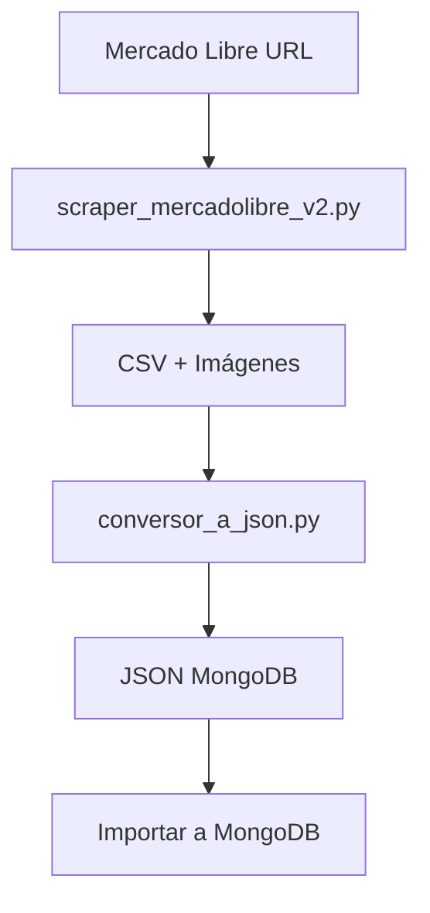

# 🛍️ Scraper de Mercado Libre con Conversión a JSON

Sistema completo de scraping de productos de Mercado Libre con extracción de detalles y conversión automática a formato JSON compatible con MongoDB/Mongoose.

## 📋 Índice

- [Características](#características)
- [Instalación](#instalación)
- [Uso Rápido](#uso-rápido)
- [Estructura del Proyecto](#estructura-del-proyecto)
- [Flujo de Trabajo](#flujo-de-trabajo)
- [Documentación](#documentación)
- [Ejemplo de Datos](#ejemplo-de-datos)

## ✨ Características

### 🔍 Scraping Avanzado
- ✅ Extracción de datos básicos (título, precio, ubicación)
- ✅ Extracción de descripciones completas
- ✅ Extracción de características técnicas (marca, modelo, etc.)
- ✅ Descarga automática de imágenes
- ✅ Exportación a Excel y CSV

### 🔄 Conversión a JSON
- ✅ Mapeo automático al modelo de MongoDB
- ✅ Generación de slugs URL-friendly
- ✅ Extracción inteligente de marcas
- ✅ Parseo de características a atributos
- ✅ Generación de tags para SEO
- ✅ Datos SEO automáticos (meta título, descripción, keywords)
- ✅ Manejo de variantes de productos
- ✅ JSON consolidado + archivos individuales

### 📁 Organización de Datos
- ✅ Estructura de carpetas organizada
- ✅ Separación por tipo de datos (CSV, imágenes, JSON)
- ✅ Fácil integración con MongoDB

## 🚀 Instalación

```bash
# Clonar/navegar al directorio del proyecto
cd /home/clynova/proyectos/scrapping_web

# Crear entorno virtual
python3 -m venv venv

# Activar entorno virtual
source venv/bin/activate

# Instalar dependencias
pip install -r requirements.txt
```

### Dependencias
- Python 3.12+
- requests 2.31.0
- beautifulsoup4 4.12.2
- pandas 2.1.4
- openpyxl 3.1.2
- lxml 4.9.3

## 🎯 Uso Rápido

### Opción 1: Workflow Completo Automático

```bash
./workflow_completo.sh
```

Este script ejecuta todo el proceso:
1. Scraping (te pregunta qué opción: 3, 10 o 48 productos)
2. Organización de datos
3. Conversión a JSON

### Opción 2: Paso a Paso

```bash
# Activar entorno virtual
source venv/bin/activate

# 1. Scraping (elegir una opción):
python test_detalles.py                    # 3 productos (~1 min)
python scraper_con_detalles_limitado.py    # 10 productos (~5 min)
python scraper_mercadolibre_v2.py          # 48 productos (~20 min)

# 2. Conversión a JSON
python conversor_a_json.py
```

## 📂 Estructura del Proyecto

```
proyectos/scrapping_web/
│
├── 📂 datos/                                 # Carpeta principal de datos
│   ├── 📂 csv/                               # Archivos CSV generados
│   │   ├── viaje_azul_productos.csv         # CSV básico (48 productos)
│   │   └── viaje_azul_productos_con_detalles.csv  # CSV con detalles (10 productos)
│   │
│   ├── 📂 imagenes/                          # Imágenes descargadas
│   │   ├── 1_Producto_1.jpg
│   │   ├── 2_Producto_2.jpg
│   │   └── ... (58 imágenes)
│   │
│   └── 📂 json/                              # JSON para MongoDB
│       ├── productos_mercadolibre.json      # Todos los productos (array)
│       ├── 1_producto-1.json                # Productos individuales
│       └── ...
│
├── 🐍 Scripts
│   ├── scraper_mercadolibre_v2.py           # Scraper principal (con detalles)
│   ├── scraper_con_detalles_limitado.py    # Scraper limitado (10 productos)
│   ├── test_detalles.py                     # Prueba rápida (3 productos)
│   ├── conversor_a_json.py                  # Conversor CSV → JSON
│   ├── workflow_completo.sh                 # Workflow automático
│   └── ejecutar_scraper.py                  # Ejecutor alternativo
│
├── 📚 Documentación
│   ├── README.md                            # Este archivo
│   ├── README_CONVERSOR_JSON.md             # Guía del conversor
│   ├── GUIA_DETALLES.md                     # Guía del scraper
│   ├── ESTRUCTURA_DATOS.txt                 # Resumen de la estructura
│   └── RESUMEN_FINAL.txt                    # Resumen del proyecto
│
└── 📄 Configuración
    ├── requirements.txt                     # Dependencias Python
    └── venv/                                # Entorno virtual
```

## 🔄 Flujo de Trabajo



### 1️⃣ Scraping
```bash
python scraper_mercadolibre_v2.py
```
**Genera:**
- `viaje_azul_productos_con_detalles.csv`
- `imagenes_mercadolibre/*.jpg`

**Extrae:**
- ID, Título, Precio, Link
- Descripción completa
- Características principales
- Características de venta
- Otras características
- URLs de imágenes

### 2️⃣ Conversión
```bash
python conversor_a_json.py
```
**Lee:**
- `datos/csv/viaje_azul_productos_con_detalles.csv`

**Genera:**
- `datos/json/productos_mercadolibre.json` (todos los productos)
- `datos/json/{sku}_{slug}.json` (archivos individuales)

**Transforma:**
- CSV → Modelo de producto MongoDB
- Genera slugs, tags, SEO
- Parsea características a atributos
- Estructura variantes de precios

### 3️⃣ Importación a MongoDB
```javascript
const productos = require('./datos/json/productos_mercadolibre.json');
await Product.insertMany(productos);
```

## 📊 Modelo de Producto

El JSON generado sigue este esquema compatible con MongoDB/Mongoose:

```typescript
{
  sku: string;                    // ID único del producto
  nombre: string;                 // Nombre del producto
  slug: string;                   // URL-friendly (auto-generado)
  categoria: "Otros";             // Categoría
  subcategoria: "Varios";         // Subcategoría
  
  descripcion: {
    corta: string;                // Max 160 chars (SEO)
    completa: string;             // Descripción completa
  };
  
  multimedia: {
    imagenes: [{
      url: string;                // URL de la imagen
      textoAlternativo: string;   // Alt text
      esPrincipal: boolean;       // Imagen principal
    }];
  };
  
  estado: boolean;                // Activo/Inactivo
  tags: string[];                 // Tags para SEO
  
  variantes: [{
    nombre: string;               // Nombre variante
    unidad: MeasureUnit;          // Unidad de medida
    precio: number;               // Precio
    descuento: number;            // Descuento %
    sku: string;                  // SKU variante
    esPredeterminado: boolean;    // Variante default
  }];
  
  atributos: {                    // Características técnicas
    [key: string]: string | number | boolean;
  };
  
  seo: {
    metaTitulo: string;           // Meta title
    metaDescripcion: string;      // Meta description
    palabrasClave: string[];      // Keywords
  };
  
  marca: string;                  // Marca del producto
  requiereRefrigeracion: boolean; // Requiere refrigeración
  ratingAverage: number;          // Calificación (0-5)
}
```

## 📖 Documentación

- **[README_CONVERSOR_JSON.md](README_CONVERSOR_JSON.md)** - Guía completa del conversor CSV → JSON
  - Mapeo detallado de campos
  - Personalización
  - Ejemplos de uso

- **[GUIA_DETALLES.md](GUIA_DETALLES.md)** - Guía del scraper con detalles
  - Configuración
  - Opciones avanzadas
  - Troubleshooting

- **[ESTRUCTURA_DATOS.txt](ESTRUCTURA_DATOS.txt)** - Resumen de la estructura de datos
  - Organización de carpetas
  - Flujo de trabajo
  - Ejemplos

## 💡 Ejemplo de Datos

### CSV Extraído:
```csv
ID,Titulo,Precio,Descripcion,Caracteristicas_Principales,Imagen_Local
3,Producto 3,$19,980,Inmovilizador Auto...,Marca: Genérica | Modelo: ABC,imagenes_mercadolibre/3_Producto_3.jpg
```

### JSON Generado:
```json
{
  "sku": "3",
  "nombre": "Producto 3",
  "slug": "producto-3",
  "categoria": "Otros",
  "subcategoria": "Varios",
  "descripcion": {
    "corta": "Inmovilizador Auto Distancia Corta...",
    "completa": "Inmovilizador Auto Distancia Corta Corriente Antirobo Autos..."
  },
  "multimedia": {
    "imagenes": [
      {
        "url": "https://http2.mlstatic.com/...",
        "textoAlternativo": "Producto 3",
        "esPrincipal": true
      },
      {
        "url": "datos/imagenes/3_Producto_3.jpg",
        "textoAlternativo": "Producto 3 - imagen local",
        "esPrincipal": false
      }
    ]
  },
  "tags": ["genérica", "inmovilizador", "marca", "modelo"],
  "variantes": [{
    "nombre": "Estándar",
    "unidad": "unidades",
    "precio": 19980.0,
    "descuento": 0,
    "sku": "3-001",
    "esPredeterminado": true
  }],
  "atributos": {
    "Marca": "Genérica",
    "Modelo": "Inmovilizador 2.4 GHZ 2M"
  },
  "marca": "Genérica"
}
```

## ⚙️ Configuración

### Cambiar URL de scraping:
Edita [scraper_mercadolibre_v2.py](scraper_mercadolibre_v2.py) línea ~461:
```python
url_tienda = "https://listado.mercadolibre.cl/tu-tienda-aqui"
```

### Cambiar categoría/subcategoría:
Edita [conversor_a_json.py](conversor_a_json.py) línea ~220:
```python
"categoria": "TuCategoría",
"subcategoria": "TuSubcategoria",
```

### Deshabilitar descarga de imágenes:
```python
scrapear_tienda_ml(url_tienda, descargar_imagenes=False)
```

### Deshabilitar extracción de detalles (más rápido):
```python
scrapear_tienda_ml(url_tienda, extraer_detalles=False)
```

## 📈 Estadísticas

### Últimas Métricas (10 productos):
- ✅ **Scraping**: 100% exitoso
- ✅ **Con descripción**: 10/10 (100%)
- ✅ **Con marca**: 10/10 (100%)
- ✅ **Con imágenes**: 10/10 (100%)
- ✅ **Tags generados**: 48 totales (promedio 4-5 por producto)
- ✅ **Atributos parseados**: 10/10 (100%)

### Tiempos de Ejecución:
| Productos | Con Detalles | Tiempo Estimado |
|-----------|--------------|-----------------|
| 3         | ✅           | ~1 minuto       |
| 10        | ✅           | ~5 minutos      |
| 48        | ✅           | ~20 minutos     |
| 48        | ❌           | ~3 minutos      |

## 🎯 Próximos Pasos

1. **Revisar datos generados**
   ```bash
   cat datos/json/productos_mercadolibre.json
   ```

2. **Subir imágenes a tu servidor/CDN**
   ```bash
   # Ejemplo con rsync
   rsync -av datos/imagenes/ user@server:/var/www/images/
   ```

3. **Actualizar rutas de imágenes en JSON** (opcional)

4. **Importar a MongoDB**
   ```javascript
   const productos = require('./datos/json/productos_mercadolibre.json');
   await Product.insertMany(productos);
   ```

5. **Configurar categorías personalizadas** según tu catálogo

## 🐛 Troubleshooting

### Error: "No module named 'requests'"
```bash
source venv/bin/activate
pip install -r requirements.txt
```

### Error: "No se encontró archivo CSV"
```bash
# Ejecutar primero el scraper
python scraper_mercadolibre_v2.py
# Luego el conversor
python conversor_a_json.py
```

### Imágenes no se descargan
Verifica la conexión a internet y los permisos de escritura en la carpeta `datos/imagenes/`.

## 📝 Notas

- El scraper respeta los tiempos entre requests (2-3 segundos) para no sobrecargar el servidor
- Las imágenes se descargan en formato JPG
- El conversor elimina campos vacíos/null para mantener el JSON limpio
- Los slugs son únicos y URL-friendly
- Compatible con Python 3.8+

## 📄 Licencia

Este proyecto es de código abierto para uso educativo y personal.

---

**Versión**: 2.0  
**Última actualización**: Diciembre 10, 2025  
**Estado**: ✅ Funcional y probado

**Autor**: Sistema de Scraping Automatizado  
**Contacto**: [Tu contacto aquí]

---

## 🎉 ¡Listo para usar!

```bash
# Ejecutar workflow completo
./workflow_completo.sh
```

¿Preguntas? Consulta la documentación en:
- [README_CONVERSOR_JSON.md](README_CONVERSOR_JSON.md)
- [GUIA_DETALLES.md](GUIA_DETALLES.md)
- [ESTRUCTURA_DATOS.txt](ESTRUCTURA_DATOS.txt)
